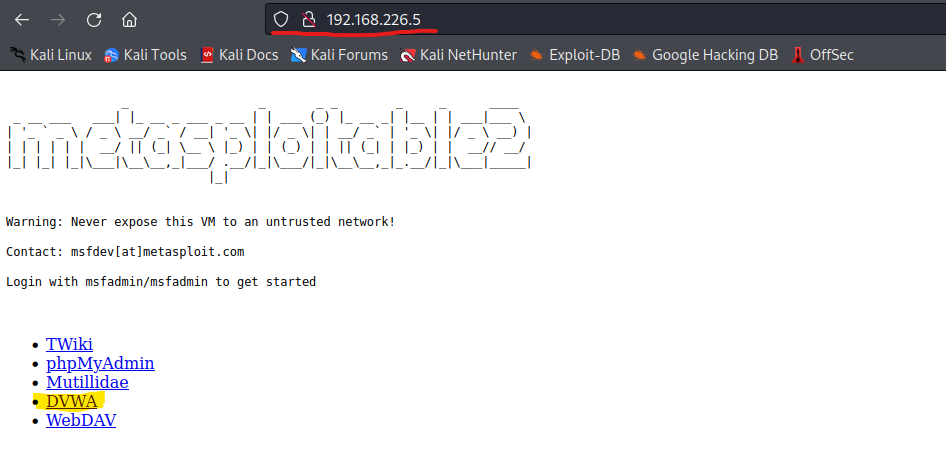

<!-- Raportti -->

# a) SELECT * FROM student
Tässä osassa harjoiteltiin SQL perusteita. Harjoituksia tehtiin osoitteessa: https://sqlzoo.net/wiki/SQL_Tutorial ja tehtävä, jota tehtiin oli **0 SELECT basics** 

#

Tehtävän osassa 1 oli komento, joka luki ja tulosti taululta maan väkiluvun, tässä tapauksessa Ranskan. Tehtävänä oli saada tulostus näyttämään Saksan väkiluvun. 


```` 
SELECT population FROM world
  WHERE name = 'France'
````


Ratkaisu oli yksinkertainen ainoa muutos komennossa oli vaihtaa "France" kohdan sijalle "Germany", jolloin komento hakee taulusta **world** valtion **Germany**.

```` 
SELECT population FROM world
  WHERE name = 'Germany'
````
#

Tehtävän osassa 2 piti muutta ensimmäisen osan mukaan taululta haettuja maita, mutta tässä tapauksessa piti vähentää myös tulostettavien maiden määrää.

````
SELECT name, population FROM world
  WHERE name IN ('Brazil', 'Russia', 'India', 'China');
````
Korjattu komento:
````
SELECT name, population FROM world
  WHERE name IN ('Sweden', 'Norway', 'Denmark');
````
#

Tehtävän osassa 3 käytetään komennon osaa **BETWEEN**, joka määrittää arvovälin, jonka komento tulostaa. Tässä tapausksessa haluttiin tulostaa tietyn kokoluokan välillä olevia maita, neliökilometrien (km²) avulla.

````
SELECT name, area FROM world
  WHERE area BETWEEN 250000 AND 300000
````
Korjattu komento:

````
SELECT name, area FROM world
  WHERE area BETWEEN 200000 AND 250000
````
Tämän jälkeen siirryttiin tehtävään **SELECT from WORLD Tutorial**

#

Tehtävän osassa 1 piti seurata, mitä komento ````SELECT name, continent, population FROM world```` tulostaa. Komennon avulla saatiin lista, jossa näkyi **maa, maanosa ja väkiluku** komento tulosti vain ensismmäiset 50 riviä.


#

Tehtävän osassa 2 piti käyttää komennon osaa **WHERE** suodattamaan pois maat, joissa asukkaita on enemmän kuin 200 miljoonaa
````
SELECT name FROM world
WHERE population = 64105700
````
Korjattu komento:
````
SELECT name FROM world
WHERE population > = 200000000
````

#

Tehtävän osassa 3 tarkoituksena on tulostaa taulu, jossa näkyy maat joiden väkiluku on yli 200 miljoonaa ja taulussa tulee näkyä maan **GDP**. Oikea tuloste saadaan valitsemalla **SELECT** komennon osalla **name** ja **gdp**, tämän jälkeen jaettiin gdp väkiluvulla ja lisättiin **WHERE** osaan, että väkiluku on suurempi kuin 200 miljoonaa.

````
SELECT name, gdp/population
FROM world
WHERE population >= 200000000
````

#

Tehtävän osassa 4 tavoitteena oli saada tulostettua taulu, jossa näkyi Etelä-Amerikan maat ja niiden väkiluku miljoonissa. Komento jolla tämä oli mahdollista oli:

````
SELECT name, population/1000000 FROM world
WHERE continent = 'South America'
`````
Komennossa väkiluku jaetaan miljoonnalla ja Etelä-Amerikan maat valitaan komennon osalla **WHERE** jossa määritellään että maanosa on sama, kuin Etelä-Amerikka.

#

Tehtävän osassa 5 on tulostettava tiettyjen maiden nimet ja väkiluku. Tämän voi tehdä komennon osalla **IN ('maa', jne)**. Suoritettu komento oli seuraava:

````
SELECT name, population FROM world
WHERE name IN ('France', 'Germany', 'Italy')
````
#

# b) Darn Low Security
Tässä osassa harjoitusta oli tarkoituksena harjoitella Injektioneita **DVWA-ohjelman** avulla. Päästäkseni harjoittelemaan tehtävää käynnistin Metasploitable 2 virtuaalikoneeni, jossa on valmiiksi asennettu webbipalvelin. Seuraavaksi käynnistin Kali virtuaali koneeni, joka on samassa verkossa, kuin Metasploitable 2.  Löysin Metasploitablen webbipalvelimen hakemmalla selaimesta Metasploitablen IP-osoitetta.



Tämän jälkeen avautui sivu, jonka kautta pääsin kirjautumaan DVWA ohjelman sisälle. Kirjautumis sivulla oli ilmoitettu default salasana ja käyttäjä tunnus, joilla pystyy kirjautumaan sisään. Päästyäni sisään, menin välilehteen **Setup** jossa valitsin vaihtoehdon, jolla luodaan tai resetoidaan tietokanta ja asetin tietokannan turvatason matalaksi.


#

# c) Execute!

Nyt siirryin tehtävä osioon eli välilehteen **Command Execution**. Tehtävässä on tarkoitus suorittaa ei tarkoitettuja komentoja käytössä olevalla syötekentällä. Syöttökentän tarkoituksena on ajaa ping komento syötetylle IP-osoitteelle, jolloin tuloste olisi seuraava:


Tämän jälkeen ajattelin, että jos tämä syöte pystyy ajamaan ping komennon, nii pystyisikö se ajamaan muita komentoja?. Tiesin että esimerkisksi merkeillä "; " tai "|" voi ajaa uusia komentoja samalla rivillä, kokeilin lisätä IP-osoitteen jälkeen uuden komennon. Yritin tällä kertaa ajaa **ls** komennon näkeäkseni mahdollisen kohteen sijainnin tiedostot. Ajoin siis komennon:

````
192.168.226.5| ls
````


Kuten tulosksessa näkyy pystyin ajamaan komennon ilman esteitä. Tuloksesta ilmeni, että on mahdollista ajaa komentoja kohde palvelimella.

#

# d) WebGoat

## SQL Injection(intro)

Tässä harjoituksessa harjoiteltiin SQL kielenkäyttöä injektio hyökkäyksissä tietokantoja vastaan. SQL kielellä pystytään katsomaan, muuttamaan ja hallitsemaan tietokantoja.

#

Ensimmäisessä harjoituksen tehtävässä oli tavoitteena tulostaa henkilön tietoja SQL kyselyllä. Tehtävän ratkaisuna oli komento:

````
SELECT depertment FROM employees WHERE userid = '94134'
````
Komennossa valitaan osalla **SELECT** tulostettava osa, **FROM** valitsee käsittelyssä olelvan taulun ja **WHERE** määrä kenen osa tulostetaan.

#

Harjoituksen toisessa tehtävässä tietokannan tulostamisen sijasta päivitettiin sen tietoja. Tämä tehtiin komennolla:

````
UPDATE employees SET department = 'Sales' WHERE userid = '898762'
````
Komennon osalla **UPDATE** määrätään, että valitun taulun tietoja muutetaan. **SET** osa komentoa määrittää mitä tietoa muutetaan ja miksi se muuttuu.

#

Harjoituksen kolmannessa tehtävässä halutaan talun sisällön sijasta muokata itse taulua lisäämällä siihen uusi pystyrivi. Tein tämän komennolla 

````
ALTER TABLE employees ADD phone varchar(20)
````
Komennon osa **ALTER TABLE** muuttaa olemassa olevan taulukon rakennetta. **ADD** osa määrittää lisättävän pystyrivin nimen ja datatyypin.

#

Harjoituksen neljännessä tehtävässä piti myöntää oikeudet käyttäjälle komennon avulla. Ratkaisun saadakseni käytin komentoa: 

````
GRANT all ON grant_rights TO unauthorized_user
````
Komennossa **GRANT** osalla annetaan oikeudet. ON osa määrittää kohde taulun ja TO kohdistaa sen käyttäjään

#

Harjoituksen viidennessä tehtävässä aloitettiin tekemään SQL injektiota tehtävässä piti valita oikeat vaihtoehdot, jotta saataisin käyttäjätiedot tulostettua. Oikea vastaus oli seuraava


Tämä komento lähettää kyselyn, joka etsii **''** eli ei ketään tai **1 = 1**, jonka vastaus on **TRUE**, koska vastaus on aina totta kyselykäy läpi ja saa takaisin kaikki käyttäjätiedon.

#

Harjoituksen kuudes tehtävä toimi samalla periaatteella, kuin edellinenkin. Tehtävässä haluttiin saada käyttjätiedot lähettämällä kysely joka on aina **TRUE** eli kysely oli **0 or 1 = 1**. Hajoituksen uusi osa oli se, että piti valita kahdesta syöttökentästä kumpaan kysely pistetään ja valitsin **User_Id** syöttökentän, koska tavoitteena oli saada käyttäjätiedot. Valinta oli oikea ja tehtä onnistui.


#

Harjoituksen seitsemännes tehtävä oli käytännössä täsmälleen sama kuin edellinen, mutta tehtävässä piti sijoittaa **'** merkit kohdilleen ja **0** sijasta piti kohdan olla tyhjä. Oletan sen johtuvan siitä että tällä kertaa ei käsitelty pelkästään numeroita.


#

Harjoituksen kahdeksannessa osassa piti muutta tietoja taululta injektiota käyttäen. Sain suoritettua tehtävän komennolla:

````
';UPDATE employees SET salary=1000000 WHERE first_name='john
````
Komennossa injektoidaan päitys tyyppinen komento injektion avulla tauluun. 

#

Harjoituksen yhdeksännessä osassa on tarkoituksena poistaa pöytä tietokannasta tämä suoritetaan seuraavalla injektionilla:

````
';DROP TABLE access_log;--
````
Komennossa merkit **';** lopettavat edellisen kyselyn ja komennon loppussa olevat **--** merkit ilmottavat ohjelmalle että sen ei tarvitse huomioida kyselyn jälkeisiä kyselyitä.

#

## Broken Authentication (Authentication Bypasses)

Tässä tehtävässä oli tarkoitus päästä kirjautumaan sisään järjestelmään hyödyntäen verifikaatio lomakkeen heikkoutta, muuttaen sitä selaimen Developer työkalujen avulla. Ohjeissa oli annettu esimerrki tapaus vastaavasta heikoudesta, missä ulkopuolisesta lomakkeesta oltiin poistettu verifikaatio kysymysten sisältö, jolloin kenttään pystyi syöttämään mitä vain ja päästiin kirjautumaan sisään. Käytin kehittäjä työkalun Inspecor ominaisuutta ja siirryn tutkimaan kyselyn html tietoja. Löysin verifikaatio kysymykset, jolloin näin että ne oli numeroitu. Vaihdoin niiden numeroinnin, sillä ajatuksella että "uusilla" kysymyksillä ei ole sisältöä, joten kirjautuminen onnistuisi.
 Olin oikeassa ja tehtävä onnistui.

 

 #

## Cross-Site Scripting (XSS) 

Ensimmäisessä tehtävässä kysyttiin saaka sivu saman cookie viestin jos sen tekee duplikaatti välilehdellä. Vastaus oli kyllä, kummassakin sivussa tuli sama viesti. Cookie viesti saatiin ajamalla javascript konsolissa komento:

````
alert(document.cookie)
````
#

Toisessa tehtävässä piti selvittää kumpi kirjoitus kenttä on altis XSS:lle tämä kirjottamalla **alert()** tai **console.log()** kenttään. Altis kenttä oli pankkikorttinumero syöte.
 

#

## Cross-Site Request Forgeries

Ensimmäisessä tehtävässä piti lähettää WebGoatin sivulla oleva lomake ulkopuoliselta hosti:lta. Tämän pystyi touteuttamaan luomalla html sivun, jonka voi lähettää lomakkeen WebGoatin ulkopuolelta. En saanut itse tehtyä sivua, joten lainasin sille pohjan täältä: https://github.com/vernjan/webgoat/blob/master/09-2018-csrf.md.


Toisessa tehtävässä idea oli sama, mutta tälläkertaa piti luoda sivu joka pystyy luomaan arvosteluja. Html sivu joka luotiin on seuraavan näköinen:


 # x) Tiivistelmä OWASP TOP 10

 A3 Injektio on hyökkäys jossa hyötykäytetään palveluiden tietokannan heikkouksia. Injektio hyökkäyksessä annetaan komentoja tietokanta palvelulle esimerkiksi sivuston kirjautumislomakkeesta. Käyttämällä erikoismerkkejä voidaan huijata järjestelmää esittämällä komennot tietona

A1 Broken Access Control


# y) Cross site story

Käyttäjä session kaappaaminen on yleinen XSS hyökkäys. Hyökkäys tehdään varastamalla käyttäjän istunto keksi, jolloin hyökkääjä voi toimia/esiintyä oikeana käyttäjänä. Käytännön esimerkkinä hyökkääjä voi lähettää itseluomansa linkin kohde käyttäjälle, kun käyttäjä on klikannut linkkiä hyökkääjä saa ilmoituksen, missä lukee session cookie eli istunto keksi. Hyökkääjän tietäessä mikä istunto keksi on, hän voi esiintyä hyökkäykseen altistuneena käyttäjänä.


