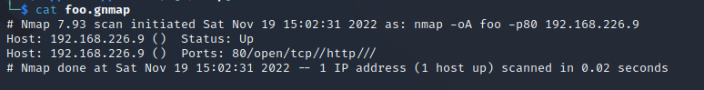

# z) Muistiinpanot
## Aktiivinen tiedustelu
* Aktiivisessa tiedustelussa, tiedustelun kohteena olevassa järjestelmässä näkyy tiedustelu.
* Tiedustelussa on tärkeää minimoida signaalit, jotka syntyvät tiedustelusta
### Metodologiat
* Port Scanning
* Web Service Review
* Vulnerability Scanning


## Port Scanning

### Työkalut
* Nmap
    * On monipuolisin ja vakaa porttiskanneri
* Masscan
    * On nopein porttiskanneri
* Udpprotoscanner
    * On nopea UDP porttiskanneri

### Nmap
* Komentoja käyttäessä on tärkeä muistaa **Output** lisäykset, niillä määritettään mihin muotoon skannaus tallentuu, esimerkkejä näistä on **-oA**  ja **-oN**
* On tärkeää ymmärtää ja määrittää portti valikoiman, lisäyksellä **-p**, sillä määritetään mitkä portit skannataan.
### Masscan
* Pystyy skannaamaan 25 miljoonaa pakettia/sekunnissa, joten se on hyvä isojen verkkojen skannaukseen
### Udpprotoscanner
* On suunniteltu UDP scannaukseen


## Web Service Review

### EyeWitness
* Ottaa kuvakaappauksen skannauksesta löytyneestä verkkosivusta
* Avustaa määrittämään mitkä verkkopalvelut pitäisi priorisoida hyökkäyksessä.
* Vaatii tiedoston, josta löytyy kohde IP:t

---

## Haavoittuvuus skannaus
* Skannerit voidaan jakaa kahteen seuraavaan luokkaan: **Network Vulnerability Scanner ja Web Vulnerability Scanner**

## Network Vulnerability Scanner

### Työkalut
* OpenVAS
* Nessus
* Nexpose
* Qualys
* Nmap

## Web Vulnerability Scanner

### Työkalut
* Nikito
* WPScan
* SQLMap
* Burp Suite
* Zed Attack Proxy
---
## Nmap

* **-sL** On Nmap lista skannaus, joka listaa kaikki määrätyn alueen IP osoitteet ja tekee käänteisen DNS haun, listatuille osoitteille. Listauksen avulla voidaan nähdä haavoittuvaisia kohteita, ilman hälytyksiä.

* **-sS (TCP SYN scan)** On tehokas TCP portti skannaus tekniikka, jonka nimi on SYN. SYN on Nmapin vakio skannaustyyppi. -sS on myös "hiljainen" skannaus, koska se ei suorit TCP yhteyksiä loppuun.

* **-sT (TCP connect scan)** TCP yhteys skanni on oletus tekniikka, jos SYN  skannaus ei ole vaihtoehto. Tekniikka toimii luomalla yhteyden kohde järjestelmään, tekemällä **connect** järjestelmä kutsun. Kohde koneella on helppo huomata että portti skannaus on tehty, koska hyökkääjä on luonut monta yhteyttä, mutta dataa ei ole lähetetty.

* **-sU (UDP scans)** Suurin osa internetissä ajetuista palveluista toimii TCP protokollalla, mutta UDP palvelujakin on laajasti käytössä. Palveluita, jotka käyttävät UDP:ta ovat esimerkiksi DNS, SNMP ja DHCP.

* **-p** Määrää skannattavat porti, ilman lisäyksiä **-p** on sama kuin  **-p1-65535** eli se skannaa kohteen kaikki portit

* **-PE -PP -PS80,443 -PA3389 -PU40125** Ovat erilaisi ping tekniikoita. **-PS80,443** Lähettää TCP SYN paketteja porteille 80 ja 443, **-PA3389** lähettää TCP ACT paketin portille 3389 ja **-PU40125** lähettää UDP paketin  portille 40,125

* **-A** pistää agressiivisen moodin päälle, jolloin skannaus sisältää OS ja palvelu havaitsemisen.

* Skannausta tehdessä, jos selviää että suurin osa kohteen porteista on tilassa **filtered** on se merkki siitä, että palomuuri säännöt estävät Nmap:in pääsyn.

- **Portti vaiheet**:
    - **open** jos portti on open tilassa, tarkoittaa se, että porttia käyttävä aplikaatio aktiivisesti hyväksyy TCP yhteyksiä, UDP datagrammeja tai SCTP liitäntöjä. Porttiskannauksessa usein tavoitteena on löytää näitä portteja

    - **closed** jos portti on closed tilassa se on saavutettavissa, mutta mikään aplikaatio ei kuuntele/käytä sitä. Tilassa olevan portin löytäminen voi olla hyödyllistä, jotta voidaan selvittää onko host ylhäällä IP osoitteessa.

    - **filthered** jos portti on filthered tilassa Nmap ei osaa määrittää onko portti auki, koska esimerkiksi palomuuri tai reititin säännöt estävät tiedustelun.


### Nmap skannauksen vaiheita:

- **Sript pre-scanning** Käytetään Nmap Scripting Engine eli NSE:tä. Nmap ei aja NSE:tä elle sitä ole erikseen komennossa käsketty, se ajaa sen lisäyksillä **-script** tai **-sC**. NSE:tä käytetään, jos Nmap:lla halutaan ajaa eri skriptejä, kuten **dhcp-discover** 

- **Target enumeration** Eli kohde listaus, on vaihe jossa Nmap listaa valitut kohteet.

- **Host discovery (ping scanning)** Verkko skannauksessa yleensä aloitetaan selvittämällä, mitkä laitteet verkossa ovat käytössä

- **Reverse-DNS resolution** Sen jälkeen kun Nmap on selvittänyt käytössä olevat laitteet se selvittää käänne DNS nimet kaikille löydetyille laitteille ping:in avulla

- **Port scanning** On Nmap:in ydin ominaisuus. Nmap lähettää tiedusteluja, jotka tutkivat eri portteja. Vastauksena Nmap kertoo onko portin tila **open, closed** tai **filtered**

- **Version detection** Jos mikään portti on aukinainen, Nmap saattaa pystyä määrittämään mitä palvelua portti ajaa.

- **OS detection** Selvittää kohteen käyttöjärjestelmän, tämän haun voi tehdä lisäyksellä **-o**.

---

# Nmap tehtävän ympärtistö:

* Hyökkäyskone: Kali Linux
    * Wireshark (running)
* Kohdekoneet: 
    * Debian 11
        * ufw (disabled)
        * Apache2 web server (running)
    * Metasploitable 2

---

# a) Nmap TCP connect scan

TCP connect skannauksessa on neljä vaihetta, mutta yksinkertaistettuna nmap tekee connect kutsun kohdejärjestelmän portille/porteille.

Tässä tehtävävässä käytin seuraavaa komentoa:

````
sudo nmap -sT -p80 192.168.226.9
````
Komennossa osa **-sT** käskee Nmappia käyttämään TCP connect tekniikkaa ja **-p** osa määrittää skannattavan portin.

Ajettuani komento skannauksen tulos oli seuraava:


Nmap löysi avonnaisen portin, mutta selvittääkseen mitä paketti tasolla on tapahtunut ja miten Nmap sai portin tilan/palvelun selvitettyä, katsotaan Wiresharkin tuloksia.


Kuvassa näkyy Nmapin neljä tekemää vaihtetta skannauksessa, ensin se lähettää kohdejärjestelmälle **SYN** lipulla merkityn TCP paketin, koska portti on tässä tilanteessa auki, lähettää kohdekone vastauksena **SYN, ACK** paketin. Saadun paketin ansiosta Nmap saa tietää, että portti on auki. Seuraavaksi Hyökkäyskone loi yhteyden lähettämällä **ACK** paketin takaisin. Viimeiseksi yhteys katkaistaan **RST, ACK** Paketilla.

---

# b) Nmap SYN scan
 Nmap käyttää default vaihtoehtonaan SYN skannausta. SYN skannaus on hyvin samanlainen, kuin TCP connection, mutta siinä on vähemmän vaiheita ja se ei ole niin "näkyvä" skannaus.

 Tässä tehtävässä käytetty komento on seuraava:

 ````
 sudo nmap -sS -p80 192.168.226.9
 ````
 komennossa **-sS** määrittää SYN tekniikan käytön, mutta Nmap ajaa sen vakiona ilmankin lisäystä. Skannauksen tulokset olivat samat, kuin tehtävän **a)** kohdassa.

 Wiresharkissa tulokset olivat seuraavat:

 

Tuloksista näkee, että SYN tekniikan kaksi ensimmäistä vaihetta ovat samat, kuin TCP connectissa, mutta tässä tapauksessa Nmap ei luo yhteyttä kohteen kanssa, vaan keskeyttää yhteyden luomisen RST paketilla.

---

# c) Ping sweep -sn

Komennon osalla **-sn** Nmap tekee niin sanotun ping sweepin, jossa se selvittää mitkä järjestelmät/IP osoitteet skannauksen alueella ovat ylhäällä, mutta komennon tärkeä ominaisuus on, se että nmap ei tee portti skannausta selvitettyään onko järjsetelmä käytössä. 

Tehtävässä käytetty komento oli seuraava:

````
nmap -sn 192.168.226.0/24
````

Skannauksen tulos oli seuraava:


Komento kävi määrätyn alueen IP-osoitteet läpi ja löysi kaksi ylhäällä olevaa järjestelmää, hyökkäys- ja kohdekoneen, mutta ei tulostanut mitään porteista. 

Wiresharkissa näkyy mitä erilaisia paketteja komento lähettää.

ICMP echo pyyntö:


ICMP on ping paketti, joka lähettää echo pyynnön kohteeseen ja saa vastauksen paketin sisällä. Tässä tapauksessa ICMP ei saanut vastausta.

Komento lähtettää ping:in saatuaan vastauksen SYN ja ACK kyselyt porteille 80 ja 443, samalla tavalla, kuin aikaisemmissa esimerkeissä.


---

# d) Nmap dont't ping -Pn

Komennon osan **-Pn** tarkoituksena on kiertää järjestelmän havainnointi vaihe, jolloin portti skannauksessa esimerkiksi Nmap tekee porttiskannauksen kaikkille annetuille IP osoitteille, ei ainoastaan käytössä oleville.

Tehtävässä käytetty komento oli seuraava: 

````
nmap -Pn -p80 192.168.226.0/24
````

Nmapin tulostustuksen viimeinen osa oli seuraava:


Tulostus näytti että skannattujen porttien tilan olevan filthered ja järjestelmien olevan ylhäällä vaikka ne eivät olleetkaan. Ainoastaan aikasemmissa esimerkeissä olevan järjestelmän portti oli auki.

---

# e) Nmap version detection -sV

Service detection tai Versio detectioni toimii lähettämällä komenno osan **-sV** käskystä tiedustelu paketteja kohde portteihin, jonka vastauksen perusteella se saattaa saada tarpeeksi tietoa määritelläkseen lisätietoa palvelusta.

Tehtävässä käytin seuraavaa komentoa:

````
nmap -sV -p80 192.168.226.9
````

Nmap antoi seuravan tuloksen:


Versio detectin lähettää monia tiedustelu paketteja, osa paketeista lähettää takaisin tietoa, kuten tässä esimerkissä:


Vastaavien tiedustelu vastausten ansiosta palvelu versio saadaan selville.

---

# f) Nmap porttien valinta -p1-100, top-ports 5, -p-

Nmapilla porttien määrittelyssä on monia vaihtoehtoja:

* Komennolla **-p1-100**, Nmap valitsee/tutkii portit 1-100


* Komennolla **top-ports 5**, Nmap ottaa valmiista listasta 5 suosituinta porttia ja skannaa ne


* Komennolla **-p-**, Nmap skannaa kaikki olemassa olevat portit


# g) Nmap ip-osoitteiden valinta

IP-osoitteita voi käyttää monella tavalla Nmapin kannsa, mutta muutamia esimerkkejä siitä on:

10.10.10.0/24, osoite hakee verkosta kaikki 1-254 mahdollista host osoitetta.


Haettua ip aluetta voi muuttaa hakemaan maskilla vaikka 65,534 osoitetta, jolloin käyttetty haku olisi 10.10.0.0/16

IP-osoitteita voi hakea myös alku- loppuosoitteella, jolloin esimerkki mahdollisesta hausta on 10.10.10.100-130, Nmap hakee tällä komennolla 31 IP osoitetta. Tällä haku tekniikalla on helppomäärittää tietyt ip osoitteet

# h) Nmap output files -oA foo

Tässä tehtäväss käytetty komento oli seuraava: 

````
nmap -oA foo -p80 192.168.226.9
````
Komento -oA foo tulostaa, kolme tiedostoa nimeltä foo, jotka ovat gnmap, nmap ja xml muodoissa.


**.nmap** muoto tallentaa Nmapin tulostuksen alkuperäisen muotoisena tiedostoon.


**.gnmap** muoto muuttaa Nmapin tulostuksen helpommin muokattavaksi Unix järjestelmille. Komennoilla, kuten grep, awk ja cut voidaan helpommin muokata tietoja.



**.xml** muodon tarkoitus on olla helposti luettavaa muille ohjelmistoille. C/C++, Java, Python koodauskielet osaavat tulkita .xml muotoa


# k) nmap ajonaikaiset toiminnot

Ovat toimintoja, joilla voi saada lisätietoja tai muokata nmap ajoa. Nätäitä komentoja käytetään, silloin kun nmap on ajamassa komentoa. 

- **v/V** Määrittää, kuinka paljon Nmap näyttää mitä ohjelma tekee. Oletuksena Nmap ei ajon aikana näytä mitään, lisätietota voidaan saada siis painamalla **v**

- **?** Näyttää eri ajonaikaiset toiminnot, joita on mahdollista käyttää.


- **p/P** Määrittä onko pakettien seuranta päällä. Pakettien seurannan päälle pistämisen jälkeen Nmap tulostaa paketti tiedot komentoriville.


- **s** Komento kertoo tietoa ajettavan Nmap komennon tilasta, esimerksi kuinka monta portia se on käynyt läpi.


# l) 'sudo nmap' ja 'nmap' erottuvuudet

Kun Nmapin ajaa root oikeuksilla se pystyy luomaan niin kutsuttuja raakoja paketteja, jotka se voi injektoida suoraan verkoon. SYN skannaus ei esimerkiksi toimi ilman root oikeuksia. Omassa testauksessani Nmap ilman root oikeuksia oli huomattavasti nopeampi, kuin root versio.

# m) Nmap skannaus nopeus

Tässä tehtävässä tuli vertailla, kahden erilaisen skannauksen nopeuksia. Tein tämän porttiskannaamalla Metasploitable2 koneeseen kahdella eri komennolla.

Ensimmäisenä käytin seuraavaa komentoa:

````
sudo nmap -p- -oN m1 192.168.226.5
````
Skannaus kesti 1.30 sekunttia


Seuraavaksi käytin komentoa:

````
sudo nmap -p- -A -oN m2 192.168.226.5
````
Komennon osa **-A** tekee OS-, palvelun versionhavaitsemista ja skripti skannausta. Skannaus kesti kokonaisuudessaan 169.25 sekunttia.


Nmap skannasi siis huomattavasti hitaammin, jos käytti **-A** komentolisäystä.

# n) Ninja skannaus webbipalvelimelle

Tehtävässä piti tutkia paikallisen webbipalvelimen versio skannausta ja miten se näkyy kohdekoneella. Kohdekoneellani oli asennettuna Apache2 ja järjestelmässä ei ollut käytössä ufw palomuuria.

Skannauksessa käytin seuraavaa komentoa:

````
sudo nmap -sV 192.168.226.9
````
Skannaus onnistui ja sain tuloksena käynnissä olevan apachen version.

Wiresharkissa näkyi että **HTTP** protokollan metodilla **GET** Nmap oli kerännyt tietoa saadakseen palvelun version. Wireshark tulokset näyttivät seuraavalta:


Seuraavaksi siirryin koneeseen, jossa apache oli käynnissä. Apachen loki tiedot löytivät sijainnista:

````
/var/log/apache2/access.log
````

Apachen lokiin oli ilmentynyt seuraavat tiedot:


Tutkimalla lokia näkyy, että liikennettä on käynyt sivulla. Tietoja katsoessa voi huomata, että apachea vastaan on käytetty Nmappia, koska osissa paketeissa lukee **compatible: Nmap Scripting Engine**. 

Tuloksien perusteella voi sanoa että Nmapin service detection ei ole hiljainen skannaus,

# UDP skannaus 

## o)

**-sU (UDP scans)** Suurin osa internetissä ajetuista palveluista toimii TCP protokollalla, mutta UDP palvelujakin on laajasti käytössä. Palveluita, jotka käyttävät UDP:ta ovat esimerkiksi DNS, SNMP ja DHCP (https://nmap.org/book/scan-methods-udp-scan.html)

## p)

UDP skannaus TCP skannaukseen verrattuna hidas ja epäluotettavampi. UDP toimii lähettämällä paketin UDP porttiin, jos paketti ei tule takaisin oletetaan, että portti on auki, jos takaisin tuleekin ICMP paketti sisältäen virhekoodin oletetaan että portti on kiinni. Palomuuri säännöt määrittävät paljon UPD skannauksen, luotettavuuteen, sillä ne voivat estää ICMP pakettien takaisin lähettämisen. **--reason** lippua kannattaa käyttää UDP skannauksess, koska se kertoo minkä perusteella skannaus määrittelee portin tilan. (https://success.qualys.com/support/s/article/000006121)

