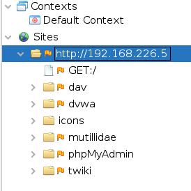
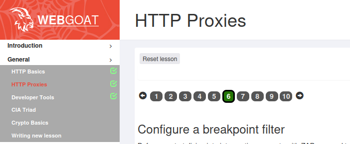

# x) How To Blow Your Online Cover With URL Previews
- Artikkelissa käsiteltiin URL previews ominaisuutta, ja kuinka se vaikkuttaa näkyvyyteesi palvelimella
- URL preview:n avulla voidaan eri viestintä sovelluksilla saada pieni näkymä sivustosta, joka on linkitetty viestissä
- Esimerkkinä artikkelissa selitettiin, kuinka sivun selaaminen eroaa URL preview:sta. URL preview:n luomisen jälkeen linkatun sivun palvelimella näkyy, että linkin lähettäjä **keskustelee** sivuston kanssa.
- Eri viestintä palveluilla on eri tapoja, muodostaa URL preview:ita, jolloin näkyvyys palvelimella on eri.
    * Facebook:
        **User-Agent: facebookexternalhit/1.1 (+http://www.facebook.com/externalhit_uatext.php)**

    * WhatsApp:
        **User-Agent: WhatsApp/0.3.1649**

 - Selaamisen ja keskustelun välisen eron tärkeys tuli ilmi esimerkkissä, joka artikkelissa annettiin. Artikkelin tekijä kuvaili, kuinka hän oli tehnyt penetraatio testausta varten phising webbi palvelimen. Webbi palvelin sai yhteyden IP-osoitteesta, joka palautui Skypeen. Tästä johtuen hän tiesi, että Skypessä keskuteltiin kyseisestä palvelimesta, tämän jälkeen hän tiesi että kohde yrityksessä oltiin hänen jäljillään.


 # y) OSINT suomessa

- Hyvä OSINT lähde suomessa on **Yritys- ja YhteisöTietojärjestelmä** (https://www.ytj.fi/index.html)

    - YTJ:n tietokannassa löytyy perustietoja osakeyhtiöistä, asunto-osakeyhtiöistä, osuuskunnista, vakuutusosakeyhtiöistä ja julkisista osakeyhtiöistä.

    - YTJ:stä voi saada yrityksen postiosoitteen ja käyntiosoitteen
    - Tietokannasta löytyy Yrityksen toimiala
    - YTJ käyttää tietolähteenä **Patentti- ja rekisterihallitusta** ja **Verohallintoa**

 # a1) ZAP asennus

 Latasin ZAP proxy:n osoitteesta: https://www.zaproxy.org/download/. ZAP veriso jonka latasin oli **ZAP 2.12.0** ja latasin sivuöta Linux Installer:in. Asentajan ladattua, ajoin sen seuraavasti:

 

Asennuksessa ei tarvinnut muuttaa asetuksia ja asennus onnistui.


# a2) ZAP selailu

Aloitin ZAP proxyn: testailun tutkimalla metasploit2 http palvelinta. Tässä vaiheessa tehtävää minulla oli kaksi vaihto-ehtoa, joko selata ja tutkia liikennet ZAP:n omalla **Manual Explore** ominaisuudella, jolloin ei tarvitse kuin hakea URL osoitteella sivu ZAP:n kautta Toisena vaihto-ehtona oli käyttää selainta. Selainta käyttäessä, pitää asettaa proxy sääntöjä sekä lisätä selaimeen ZAP root sertifikaatti.

Kokeilin ensin ZAP: Manual Explore ominaisuutta. Haen siis Metasploit koneen IP-osoitteella sen sivuja, jolloin Manual Explore näyttää seuraavalta: 


Painamalla nappia **Launch Browser** ZAP avaa ikkunan sivulle ja sivua selaillessa tallentaa liikenteen ZAP sessioon. Tässä tapauksessa selailin Metasploitin palvelinta ja sen sivun välilehtiä, jonka jälkeen ZAP näytti seuraavalta:



Tässä kohtaa siirryin tutkimaan GET:/ metodia. Lisätietoa siitä sai ZAP:n **Request ja Response** välilehdistä. **Request** välilehdestä voidaan nähdä GET pyynnön sisältö ja **Response** näyttää pyynnön vastauksen 

**Request:** 


**Response:** 


# b) ZAP certificate 

Seuraavaksi halusin siepata TLS liikennettä(https sivustoja) selaimen kautta. Siepataksesi TLS suojattua liikennettä selaimella, pitää selaimeen lisätä sertifikaatti, jota ZAP käyttää ja tehdä siitä luotettava selaimelle. Sertifikaatti nimi on **Root CA certificate**, se löytyy ZAP:n sisällä yläpalkin kohdasta **Tools** ja **Options**.


Valittua **Options** kohdam tulee näkyviin lista työkaluja, joista valitaan **Network/Server Certificate**. Valittua työkalu tulee esiin ZAP:n luoma sertifikaatti, joka tallennetaan ja lisätään selaimelle.


Sertifikaatti lisättiin selaimen(firefox) asetuksista, kohdasta **Privacy and Security** ja **Certificates**.


Sertifikaatin lisättyä, pystyin selaimen kautta nappaamaan **TLS** liikennettä ZAP:n avulla. Tässä tilanteessa menin osoitteeseen https://www.zaproxy.org. ZAP näytti seuraavalta:


# c) Mitmproxy

Mitmproxy on komento linja webbi proxy. Mitmproxy oli löytyy valmiiksi asennettuna työkaluna Kali Linux:ssa. Mitmp käynnistetään seuraavalla komennolla:

````
mitmproxy
````

Komentoa käyttäen mitmproxy kuuntelee porttia 8080, halusin että se kuuntelee porttia 8081, joten käytin seuraavaa komentoa:

````
mitmproxy -p 8081
````
Komennon avulla se kuuntelee nyt porttia 8081


Seuraavaksi käynnistin Firefoxin, jossa olin määritellyt proxy portiksi 8081 portin. Seuraavassa kuvakaappauksessa näkyy liikenne mitmproxy:ssa


# d) Mitmproxy sertifikaatti 

Sertifikaatin asentaminen selaimeen tapahtuu selaimen osalta samalla tavalla, kuin aikaisemmin, mutta tässä tapauksessa, sertifikaatti pitää manuaalisesti löytää ja kopioida kansioon, josta selain sen löytää.

Sertifikaatti löytyy sijainnista ````/home/hippi/.mitmproxy````. Löysin sijainnin mitmproxy:n omista ohjeista sivulta:
https://2qwesgdhjuiytyrjhtgdbf.readthedocs.io/en/latest/certinstall.html. Sertifikaatin nimi oli **mitmproxy-ca-cert.cer**. Kopioin tiedoston uuteen sijaintiin.

Seuraavaksi menin selaimen asetuksien kohtaan **Privacy and Security** ja **Certificates**, jossa lisäsin tiedoston luotettavien sertifikaattien listaan. Tämän jälkeen Mitmproxy pystyi kaappaamaan https liikennettä


# e) WebGoat ja proxy

Tässä tehtävässä käytin ZAP proxy:ä. Tekemäni tehtävä WebGoati:ssa oli **HTTP Proxies 6** 



Tehtävässä oli tarkoituksena kaapata POST pyyntö ja muuttaa sitä, käyttämällä breakpoint ominaisuutta proxy:ssa.

Ensimmäiseksi pistin breakpointin päälle, se löytyi ZAP näkymän yläpalkista


Seuraavaksi lähetin pyynnön WebGoatin kautta ja proxy sieppasi pyynnön. Vaihdoin tehtävän mukaan pyynnön **POST** metodista **GET** metodiin, muutin **changeMe=** kohdan tekstiä ja lisäsin **request-intercepted:true** kohdan.


Siirryin seuraavaan pakettiin ja sain seuraavan pyynnön, jossa näkyi, että onnistuin tehtävässä.


